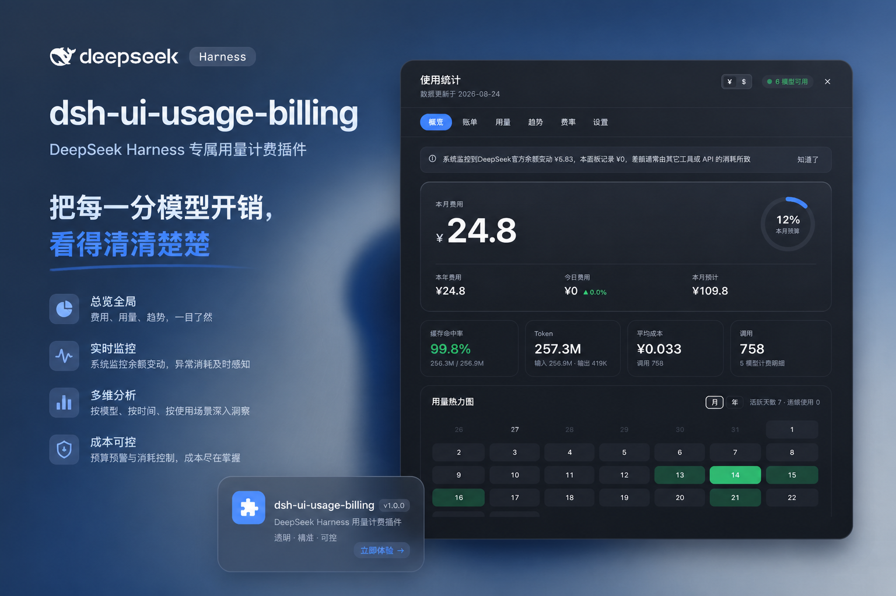
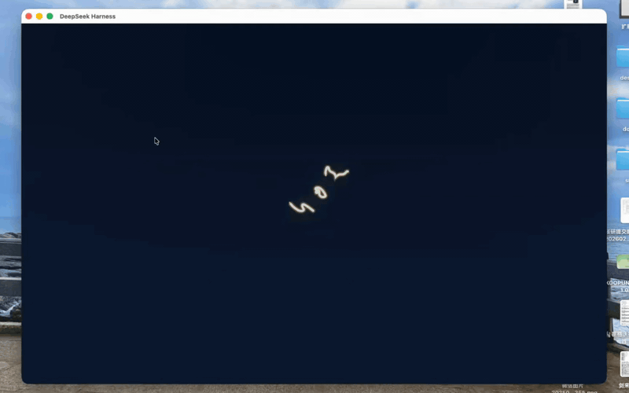

<div align="center">

# dsh-ui-usage-billing

<p align="center">See every cent of your model spend — at a glance.</p>

<p align="center">
  <a href="https://github.com/kenz1117/dsh-ui-usage-billing/stargazers"></a>
  <a href="https://www.npmjs.com/package/@kenz1117/dsh-ui-usage-billing"></a>
  <a href="https://www.npmjs.com/package/@kenz1117/dsh-ui-usage-billing"></a>
  <a href="https://github.com/kenz1117/dsh-ui-usage-billing/blob/main/LICENSE"></a>
  <a href="https://github.com/kenz1117/dsh-ui-usage-billing/pulls"></a>
  <a href="https://github.com/kenz1117/dsh-ui-usage-billing"></a>
  <a href="https://github.com/kenz1117/dsh-ui-usage-billing/graphs/contributors"></a>
  <a href="https://awesome-dsh-plugin.com"></a>
</p>

[English](README.en.md) · [中文](README.md)

</div>

---

> **Rate-table display update (2026-08-27)**: the models.dev supplement is **no longer rendered in full** — the rate table previously listed all ~5900 models from 158 gateway providers, drowning out the ones actually in use. The table now contains only the built-in catalog plus probed (configured and reachable) models. Billing is unaffected: models outside the catalog but priced on models.dev are still estimated at their official USD prices when hit; they just no longer appear in the table.

> **Qwen family pricing update (2026-08-27)**: aligned with the latest Alibaba Cloud Model Studio list prices — **Qwen3.7-Max** corrected to official list price (input ¥12 / explicit-cache hit ¥1.2 / output ¥36, previously recorded at the discounted promo rate). The current official 50%-off promotion has **no announced end date**: the rate table shows the discounted price with a red promo badge (hover for details), and resumes list-price display once an end date is filled in after the announcement. The Qwen family also gains **supplementary pricing reference rows** (Batch File standing half-price tier, Batch Chat, explicit-cache create/hit — display-only, excluded from estimation); Qwen3-Coder Plus officially does not support batch inference, so only the explicit-cache rows are listed.

> **Peak/off-peak pricing update (from 2026-08-23 (Sun) 00:00 Beijing)**: DeepSeek models follow the new official rule — **weekdays (Mon–Fri)** keep the original peak/off-peak split (peak 09:00–12:00 / 14:00–18:00, ×2); **weekends (Sat/Sun)** are no longer split and are billed at the **off-peak price** all day. The plugin's billing engine, rate table and per-turn peak/off-peak bands all reflect this.

<div align="center">
  
</div>

### Demo GIF



## ✨ Highlights

- **Real usage, no fabricated samples** — the server aggregates from persisted session logs and estimates against live multi-provider official prices; it shows an empty snapshot until real data arrives.
- **Everything on one screen** — a sidebar trigger card plus a full dashboard (Overview / Trends / Providers / Stats / Rates / Settings) across six tabs: month / today / projection / heatmap / trend.
- **Subscriptions · balance · quota · reconcile** — plan quota, multi-provider balance, relay-station quota, declared endpoints and balance-delta reconciliation form a cross-verifiable billing loop.
- **Peak/off-peak pricing + switch alerts** — weekday peak split and weekend all-day off-peak, with a popover / system notification before a tier switch, configurable lead time.
- **Offline & self-contained** — no chart library, no external CDN, pure design tokens; lightweight and ready to use.
- **Multi-language + dual currency** — Chinese / English, ¥/$ toggle that only affects this plugin.

## 📊 Dashboard

- **Sidebar entry**: a dashboard-style trigger card above the Settings button — month cost as the headline number (monospace) with a 7-day sparkline mini-trend, second line "Today / This week"; collapses to an icon button; hover reveals a quick-look card.
- **Billing dashboard (tabbed)**: Overview / Trends / Providers / Stats / Rates / Settings — hero figures + YoY/DoD + month projection + KPI×4 + heatmap; 7/30-day trend (switches between Cost / Tokens); provider billing & subscriptions; export / cost breakdown / workspaces / session detail; model rate table; budget & peak alerts. Restrained tones, `--dsw-*` tokens, dark/light adaptive.

  
- **Live cost bar**: below the composer, persistent "This turn ¥x · Session ¥y" plus the peak/off-peak tier & switch countdown and subscription low-quota chips (≤20% appear, ≤10% red).
- **Peak/off-peak switch alert**: a popover before a tier switch plus an optional system notification (lead time / position / mode / preview configurable), distinguishing "About to enter peak ×2 — can wait" / "About to enter off-peak, price halves".
- **Plugin info card**: a persistent "About" card in the Settings tab — name, description, author (jump to GitHub), source repo, npm, MIT license, version (read server-side from the package's `package.json`, single source of truth, correct on publish).

## 💰 Billing engine

- **Live-priced rate table**: models.dev fetched pricing + live-model alignment — the models actually configured are all included; peak/off-peak split (weekdays 9-12 / 14-18 peak ×2, weekends off-peak all day) plus a live USD→CNY rate, refreshed every 6 hours.

  
- **Official vs third-party buckets**: the detail cost column is split by official DeepSeek direct / third-party relay ("official x / third y" when mixed); the Stats tab has an official/third-party summary card.
- **Monthly budget + tier alerts**: a budget bar (on/off / amount / progress, ≥80% amber, over red pulse); notifies once per tier crossing 50/80/100%.
- **Cost-spike attribution**: per-turn cost bars (last 40 turns, amount at bar top, peak/off-peak background bands, >2× spike flagged with attribution).

## 🔌 Subscriptions & balance

- **Subscription quota**: detects subscription providers in `llm-pi-ai` (Kimi / Z.ai / OpenCode Go / MiniMax / OpenRouter / Xiaomi / Volcano…); those with a quota API show remaining % and reset time live, exhausted in red, no API shown as "not wired"; subscription-channel model cost is 0. **MiniMax note**: use the `minimax-token-plan-cn` provider id for `https://api.minimaxi.com`; the international route keeps `minimax` / `minimax-token-plan` against `https://www.minimaxi.com`. Override `baseUrl` per provider for proxies or staging.
- **Multi-provider balance**: DeepSeek / Kimi / StepFun / SiliconFlow / xAI / Zhipu GLM (Z.ai CN region) built-in official balances, and the balance column estimates "≈N days" from the 7-day daily burn.
- **Custom provider balance**: configure any HTTP endpoint for balance (`extract` supports constant / dot-path / add-subtract / divide, header `{{ENV}}` via the credentials seam).
- **Declared endpoints + balance reconcile**: **declared endpoints** (`declaredEndpoints`) let you self-declare balance/quota interfaces for vendors absent from the built-in table — you write only dot-paths ("where the number is"), no expressions; the request URL is built from the matched same-origin provider's `origin`, and safety bounds (single-slash absolute path, GET only, reject cross-origin redirects, response-size/timeout caps, credentials only from the matched provider's own `apiKeyEnv`) are enforced by `src/declarative.ts`; a wrong path is shown in the UI as `declared` with a `reason`. **Balance reconcile** (`reconcilePath`) cross-checks the official (DeepSeek-direct only) balance change against the local ledger's official-channel cost for the day, and flags a drift above the threshold (0.3 CNY and >15%) so you can double-check the price table or recent bills; top-ups / grants / currency changes reset the baseline instead of alerting, and a flat balance (subscription spend) stays silent.
- **Relay-site attribution & quota**: usage is grouped by a provider's `baseURL` origin — multiple keys on the same relay station merge into one row, named by its domain. Routes with a `baseURL` are auto-detected as New API (`/api/status`) or Sub2API (`/v1/usage`) to read their **balance and rolling quota windows**, labeled "no quota" when unreadable, <20% remaining in red; station recognition is cached for 5 minutes (multiple keys on one station fuse-break independently), and the `relay-quotas` endpoint attaches `diagnostics` for "why is my relay not showing". Project attribution prefers the workspace title for naming. **Unpriced models** (out-of-catalog / no price) count as 0 cost, with a "N models not priced" hint under the hero.

  

## 📈 Usage visualizations

- **Session detail + cost spikes + heatmap**: sessions sorted by cost (title / project / calls / cost / last active); per-turn cost bars (peak/off-peak background bands, >2× spike flagged with attribution); month / year calendar heatmap (5-color scale, hover detail; the year view is ~52 weeks, GitHub-style), with active-day and streak counts on top.
- **Performance metrics**: per-model first-token latency (TTFT) mean / P50 / P90, generation speed (tokens/s), total-latency mean, plus per-hour TTFT and speed curves aggregating by Beijing hour; rendered in the Stats tab as a per-model performance table and per-hour TTFT/speed dual line charts.
- **Token insights**: a dedicated "Tokens" tab — daily token stacks colored by "input (cache miss) / input (cache hit) / output" (including reasoning), per-model totals and share, structural KPIs (cache-hit rate / reasoning share / input-output ratio / peak day); per-day token CSV and JSON export.

  
- **Export + offline self-contained**: the Stats tab exports daily / per-session / per-site CSV and full JSON; cost breakdown / workspaces / session-detail sections are drillable (click a project row to expand its sessions); no chart library, no external CDN, pure design tokens.

  

## 🛡️ Robustness & privacy

- **Real usage aggregation**: the server aggregates from session logs on demand (incremental cache recomputes only written sessions), with per-session corruption tolerance and snapshot fallback; an optional `usage_stats` tool lets the model query today / month / current session / cumulative spend, plus `bySite` (relay-attributed) and `relay` (relay-only) summaries (toggle it in Settings; takes effect after a reload).
- **Model health + uncatalogued annotation**: provider connection dots (green / red / grey); a model id not in the catalog is marked "uncatalogued" priced at the fallback, with provider inferred (e.g. `mi-mimo-2.5` → Xiaomi); estimated-price models are marked "estimated".
- **Multi-language + dual currency**: the ¥/$ switch is bilingual (USD→English, CNY→Chinese, this plugin only); the rate table converts to the selected currency.
- **Security hardening**: every HTTP endpoint enforces loopback-only access via a dual check of the peer socket address and an exact Host-header match (literal loopback IP, not a prefix), rejecting `127.0.0.1.evil.com`-style DNS-rebinding names; the `/api/billing/usage-tool` write path additionally validates a loopback Origin and `application/json` Content-Type with a body-size cap to block cross-site rewrites; balance / subscription / relay queries and pricing fetches carry bounded retries with per-upstream circuit breaking (auth failures are config issues and do not trip the breaker).
- **Export injection guard**: daily / session / site CSV cells starting with `=` / `+` / `-` / `@` are prefixed with a single quote, and commas / quotes / newlines / carriage returns are fully escaped, so they cannot be executed as formulas in Excel / WPS.
- **Privacy baseline**: a pure UI surface — registers no tools, injects no system prompt, writes no model-visible events; it only aggregates from existing session logs, whose content is owned by other packages.

## 🚀 Quick start

Add to the host `cordis.patch.yml`:

```yaml
- insert:
    - id: ui-usage-billing
      name: '@kenz1117/dsh-ui-usage-billing'
```

Or install via a package manager:

```sh
npm install @kenz1117/dsh-ui-usage-billing
```

After the host starts, the billing entry appears above the sidebar Settings. No extra configuration is needed; when `sessionPersistence` is available it aggregates real usage automatically.

## ⚙️ How it works

The plugin has a server side and a browser side:

```
Browser                                   Server (Node)
  │                                        │
  ├─ GET /api/billing/usage-stats ────────▶ ├─ sessionPersistence walks persisted session logs
  │                                        ├─ attributes a call to its preceding request/header model
  │                                        ├─ buckets tokens by cache hit / miss
  │                                        └─ estimates cost (CNY) from the live rate table
  ├─ GET /api/billing/pricing ────────────▶ ├─ live USD→CNY rate and model prices
  ├─ GET /api/billing/balance ────────────▶ ├─ DeepSeek official balance API (credentials seam)
  ├─ llm.models health probe ─────────────▶ └─ returns aggregated stats JSON
  └─ renders the dashboard
```

- **Server** (`src/index.ts`): injects `webServer`, `sessionPersistence` and `credentials`, and registers `GET /api/billing/usage-stats`, `/api/billing/pricing`, `/api/billing/balance`, `/api/billing/subscriptions`, `/api/billing/relay-quotas`. The aggregator caches folded results per session: each LLM call is attributed to the model of its preceding `request/header`, tokens split into cache-hit / cache-miss buckets, dates bucketed by the local timezone; a log file with unchanged mtime+size reuses its cached fold, only written sessions are re-folded, and the whole document has a 5s TTL to coalesce heavy polling. Every successfully folded session is also atomically written to an independent durable usage ledger, so permanently deleting a session no longer removes its historical cost or tokens. Aggregation logic lives in `src/aggregate.ts`.
- **Browser** (`src/client/`): requests the endpoints above to render the dashboard and probes each provider connection via `llm.models`. Until real data arrives it shows an all-zero empty snapshot, never fabricated samples.

## 🧩 Theme collaboration

This plugin **depends on no theme package** and runs standalone. The dashboard modal declares a `billing.dashboard.decor` decoration slot (head / hero / trend / models / footer anchors) and registers a real-time cost summary as the `ctx.billingMetrics` service: theme plugins (e.g. acid-zine) inject their own decoration visuals (MacDots, tape, torn notes…) and subscription-cost data into their sticker layer. Plugin and theme load/unload independently — with no theme the default visuals apply; without billing the theme still runs.

## 💡 Billing details

The rate table (`src/client/pricing.ts`) stores each model in its **native currency**: domestic providers enter CNY directly, overseas providers enter USD. Cost is computed and displayed in CNY uniformly — USD models convert via the **live rate**, domestic models never pass through a rate. At startup the server fetches the live rate and model prices (`src/pricing-fetch.ts`): USD→CNY prefers the Tencent Finance quote (keyless, reachable in China), falling back to open.er-api then the built-in default; it then refreshes every 6 hours, and the rate-table modal shows a "today's rate" marker plus live / built-in badge. The **display currency follows the user**: switching ¥ / $ converts each per-1M-token unit price via `convertUnitPrice` at the live rate (falling back to the native currency when the rate is unavailable).

```
cost (CNY) = (missInput × p_input + cacheHit × p_cacheHit + output × p_output) / 10⁶
           —— prices in native currency; USD models convert at the live USD → CNY rate
```

`input` in the stats is total input (cacheHit + cacheMiss); estimation splits it into hit / miss to avoid double counting. Models with two-band billing are mixed by `DEFAULT_PEAK_SHARE` (default 0.5); weekends (Beijing Sat/Sun) are charged at the off-peak rate all day.

### Supported models (2026-08-21 lineup, OpenAI-compatible)

| Provider  | Models                                                                                       |
| -------- | ------------------------------------------------------------------------------------------- |
| DeepSeek | V4 Flash, V4 Flash Vision (Exp), V4 Pro (peak/off-peak billing: weekdays peak 09:00-12:00 / 14:00-18:00 Beijing = 2× off-peak; weekends off-peak all day) |
| Zhipu AI  | GLM-5.3, GLM-5.2, GLM-5.1, GLM-5-Turbo, GLM-4.7, GLM-4.6, GLM-4.5-Air, GLM-5V-Turbo                                       |
| Aliyun    | Qwen3.8 Max, Qwen3.7-Max, Qwen3.5-Plus, Qwen3.5-Flash                                        |
| Doubao    | Seed-2.0 Pro, Seed-2.0 Mini, Seed-1.6                                                         |
| Moonshot  | Kimi K3, K2.7 Code, K2.7 Code HighSpeed, K2.6                                                 |
| Xiaomi    | MiMo V2.5 (exempt when billed via a token-plan subscription channel)¹                         |
| MiniMax   | MiniMax-M3, MiniMax-M2.7, MiniMax-M2.7-highspeed                                            |
| Baidu     | ERNIE-5.1                                                                                   |
| Tencent   | Hunyuan T1, Hunyuan Hy3                                                                     |
| 01.AI     | Yi-Lightning                                                                                |
| StepFun   | Step 3.7 Flash                                                                              |
| iFlytek   | Spark 4.0 Ultra (plan-based)¹                                                                |
| SenseTime | SenseNova 6.5 (beta)¹                                                                        |
| Baichuan  | Baichuan M3-Plus                                                                            |
| OpenAI    | GPT-5.6 Sol / Terra / Luna                                                                  |
| Google    | Gemini 3.1 Pro, 3.6 Flash (Standard / Flex two-band, Flex = −50%)                            |
| xAI       | Grok 4.6, Grok 4.3                                                                          |
| Meta      | Llama 4 Maverick, Scout                                                                     |
| Other     | Unified fallback pricing for uncatalogued models                                             |

> ¹ iFlytek, SenseTime and Xiaomi have not published per-token prices — the table shows estimates; cost is 0 when these models go through a subscription channel (coding / token plan / opencode), and recalibrates automatically when official pricing is published. Subscription channels align with pi-ai built-in providers (kimi-coding, zai-coding-cn, opencode, opencode-go, qwen/xiaomi token-plan regional variants), overridable via `subscriptionProviders`.

To add a model: append an entry to `MODEL_CATALOG` and map its real id in `MODEL_KEY_ALIASES` in `src/client/pricing.ts` (shared by the aggregation layer and the client renderer).

## 🔌 HTTP API

The public HTTP endpoints and field definitions are documented in source: `GET /api/billing/pricing`, `/api/billing/balance`, `/api/billing/usage-stats`, `/api/billing/subscriptions`, `/api/billing/relay-quotas` (see `src/index.ts`, `src/aggregate.ts`, `src/relay.ts`). The `usage-stats` payload carries `bySite` (relay-attributed usage distribution: `site:<origin>` / `direct:<provider>` / `unknown`) and `unpricedModels` (ids of models with no price); `relay-quotas` returns `quotas` plus `diagnostics` (per-route origin / kind classification, for "why is my relay not showing"). All endpoints accept loopback requests only (peer socket address + Host header verified).

## ⚙️ Configuration

| Field                    | Default                                  | Description                                                                                                           |
| ----------------------- | --------------------------------------- | -------------------------------------------------------------------------------------------------------------------- |
| `statsPath`             | unset                                   | Absolute path to a fallback `.dsh-usage-stats.json` (used when `sessionPersistence` is unavailable)                    |
| `ledgerPath`            | `~/.dsh/.dsh-usage-ledger.json`         | Independent durable ledger path; stores folded metrics only (no message bodies or session titles), so deletion does not erase recorded usage |
| `balanceApiKeyEnv`      | `DEEPSEEK_API_KEY`                      | Credential ref for the DeepSeek balance query; only used as a fallback when llm-pi-ai has no `apiKeyEnv` for deepseek |
| `subscriptionProviders` | `kimi-coding`, `xiaomi-token-plan-cn`   | Subscription (coding / token plan) provider id list — tokens counted, cost 0                                        |
| `monthlyBudget`         | unset                                   | Default monthly budget (CNY); sent with usage-stats as the budget bar's initial amount (user UI settings take precedence and persist locally) |
| `lowBalanceThreshold`   | `50`                                    | Low-balance alert threshold (CNY); sent with usage-stats, alerts once a day when any provider's CNY balance is below it |
| `subscriptionPlans`     | auto-detect                             | Subscription quota adapter whitelist (`{ provider, baseUrl?, region? }`); when unset, auto-detects all subscription providers from `llm-pi-ai` (queries those with a quota API, marks the rest) |
| `declaredEndpoints`     | unset                                   | Declared endpoints (`{ displayName, origin, path, fields?, windows?, raw? }`): self-declare balance/quota interfaces for providers absent from the built-in table, writing only dot-paths ("where the number is") with no expressions; the request URL is built from the matched same-origin provider's `origin` and safety bounds (single-slash absolute path, GET only, reject cross-origin redirects, response-size/timeout caps, credentials only from the matched provider's own `apiKeyEnv`) are enforced by `src/declarative.ts` |
| `reconcilePath`         | `~/.dsh/.dsh-usage-reconcile.json`     | Balance-delta reconcile baseline path; cross-checks the official (DeepSeek-direct only) balance change against the local ledger's official-channel cost for the day, and flags a drift above the threshold (0.3 CNY and >15%); top-ups / grants / currency changes reset the baseline instead of alerting |

## 🛠 Development

Requirements: Node.js ^22.19 || >=24, pnpm.

```sh
pnpm install
pnpm --filter @kenz1117/dsh-ui-usage-billing bundle   # builds lib/index.js and lib/client.js
npx vitest run packages/client/ui-usage-billing/tests  # unit tests
```

## 📦 Release

This package is a standalone npm package that other DeepSeek Harness hosts can install once published.

```sh
npm publish --access public
```

The host discovers the browser side automatically via the `dsh.client` declaration (`platform: web`) and the `exports["./client"]` bundle in `package.json` — no registry registration needed.

## 🤖 Model Experience

None. This plugin is a pure UI surface: it registers no tools, injects no system prompt, writes no model-visible events to the session log, and touches no session KV cache; usage statistics are aggregated by the server from existing session logs, whose content is owned by other packages.

## ⚠️ Known Limitations and Deferred Work

- **Balance queries cover DeepSeek / Moonshot (Kimi) / StepFun / SiliconFlow / xAI / Zhipu GLM (Z.ai CN region)**: these use a standard Bearer API key. Other providers expose no public balance API or need non-Bearer auth (Xiaomi MiMo via console Cookie, SenseTime via AccessKey signing, MiniMax/Doubao via quota or AK/SK), so they currently show "not configured"; the extension point is `src/balance.ts` (add a querier per provider balance API).
- **Relay quota depends on upstream private schemas**: New API / Sub2API interface fields are not public, so an unreadable station is labeled "no quota" rather than fabricating an amount; if a station's response fields differ, extend the parsers in `src/relay.ts`. An "unknown route" means that route no longer exists in the current provider config (renamed / deleted); historical call data is not lost — re-adding the same-named route restores attribution automatically.
- **Overspend notifications rely on the browser Notification API**: when permission is denied or the platform lacks support, only the in-UI red-pulse fallback remains — no host-level notification channel; notifications are capped at once per day.
- **Session rows are not navigable**: clicking a session row does not open that session (cross-plugin navigation needs a host session-selection channel); sessions are capped at 100 rows and the panel shows the top 20.
- **Cost is a catalog estimate**: models without published per-token pricing (iFlytek, SenseTime, Xiaomi) use estimates (feature-list footnote ¹); official billing is authoritative.
- **The ledger starts at its first successful aggregation**: sessions permanently deleted before the upgrade and absent from the old snapshot cannot be recovered. Manually deleting `.dsh-usage-ledger.json` and its `.bak` clears independently retained history. Only calls successfully observed by this plugin are retained.

## ❤️ Contributors

- [@ciphoo](https://github.com/ciphoo) — MiniMax CN Token Plan quota support (PR #5)
- [@fabulousyuann-tech](https://github.com/fabulousyuann-tech) — durable ledger that retains usage after session deletion (PR #8)

## 📄 License

[MIT](LICENSE) © 2026 KenZ (kenz1117)
