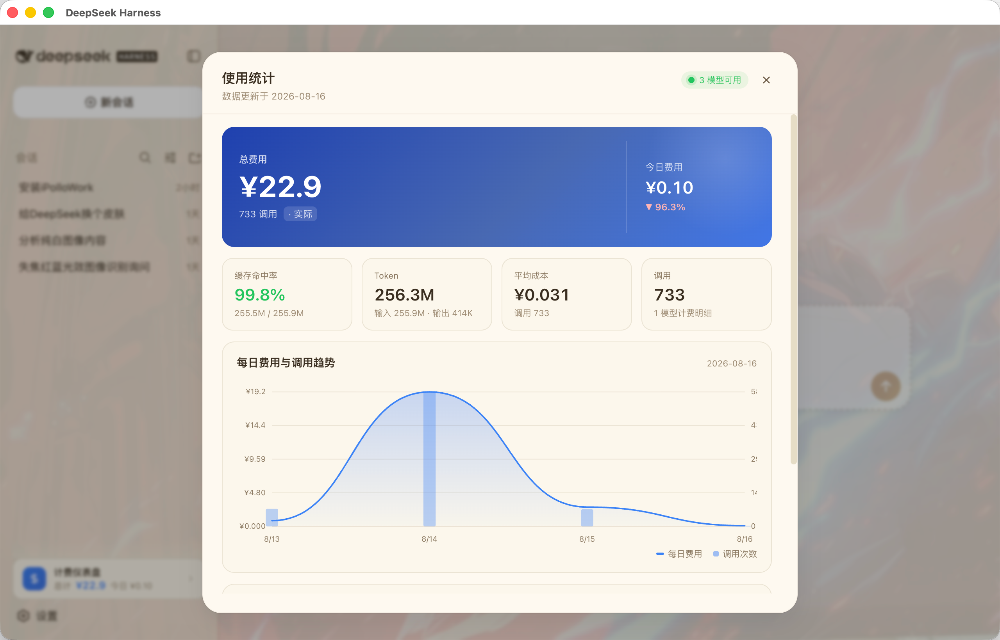
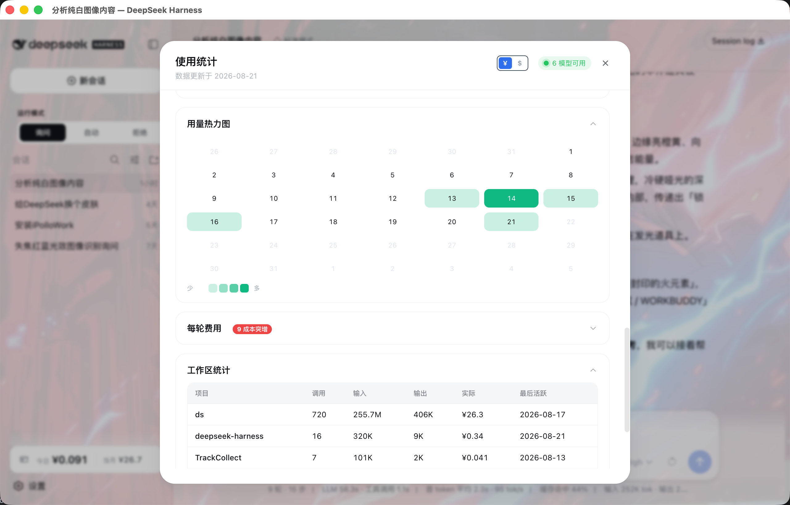
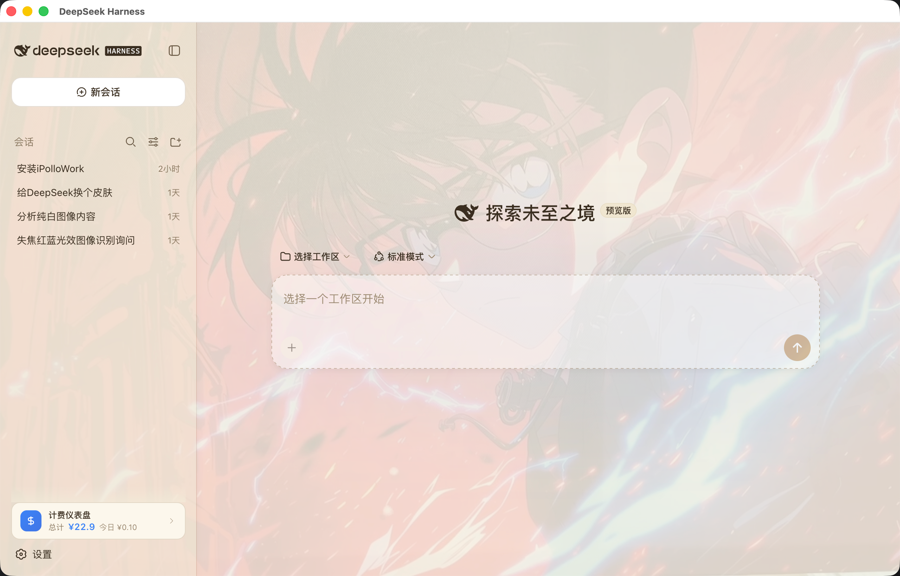

# dsh-ui-usage-billing

DeepSeek Harness 计费仪表盘插件。从持久化会话日志实时聚合模型用量，按多厂商最新官方价格估算费用，在侧边栏一键查看完整仪表盘。

[](https://github.com/kenz1117/dsh-ui-usage-billing/blob/main/LICENSE)
[](https://github.com/kenz1117/dsh-ui-usage-billing)
[](https://github.com/kenz1117/dsh-ui-usage-billing)
[](https://www.npmjs.com/package/@kenz1117/dsh-ui-usage-billing)

## 特性

- **侧边栏入口**：设置按钮上方的触发胶囊，显示**当月费用 + 今日费用**；折叠栏自动切换为图标。
- **计费仪表盘**：Hero 按 **当年 / 当月 / 当日** 三维展示费用，KPI 指标（缓存命中率 / Token 总量 / 单次平均成本 / 调用次数）、按模型分色的**堆叠趋势图**、按模型计费明细、可展开的单价表。
- **真实用量**：服务端从会话日志实时聚合，无需手工维护统计文件。
- **模型健康探测**：模型行的圆点反映各厂商接入状态（正常绿 / 异常红 / 未接入灰）。
- **订阅计划豁免**：走 coding/token 套餐的模型照常统计 token，费用记 0。
- **离线自包含**：无图表库、无外部 CDN，全部使用设计令牌，适配深色/浅色主题。

## 截图







## 快速开始

在宿主 `cordis.patch.yml` 中加入：

```yaml
- insert:
    - id: ui-usage-billing
      name: '@kenz1117/dsh-ui-usage-billing'
```

或通过包管理器安装：

```sh
npm install @kenz1117/dsh-ui-usage-billing
```

启动宿主后，侧边栏设置上方即出现计费入口。无需额外配置；`sessionPersistence` 可用时自动聚合真实用量。

## 工作原理

插件由服务端与浏览器端两部分组成：

```
浏览器端                                  服务端（Node）
  │                                        │
  ├─ GET /api/billing/usage-stats ────────▶ ├─ sessionPersistence 遍历持久化会话日志
  │                                        ├─ 按 request/header 归属模型
  │                                        ├─ token 按缓存命中 / 未命中分桶
  │                                        └─ 按单价表估算费用（人民币）
  ├─ llm.models 健康探测 ─────────────────▶ └─ 返回聚合统计 JSON
  └─ 渲染仪表盘
```

- **服务端**（`src/index.ts`）：注入 `webServer` 与 `sessionPersistence`，注册 `GET /api/billing/usage-stats`。每次调用折叠全部持久化日志：一次 LLM 调用归属到其前置 `request/header` 记录的模型，token 拆分到缓存命中 / 未命中桶，日期按本机时区归天。聚合逻辑见 `src/aggregate.ts`。
- **浏览器端**（`src/client/`）：请求上述接口渲染仪表盘，通过 `llm.models` 探测各厂商连接状态。真实数据到达前显示全零空快照，不展示伪造样本。

## 计费引擎

单价表（`src/client/pricing.ts`）采用**原生币种**存储：国内厂商直接录入人民币价格，国外厂商录入美元价格。费用统一以人民币计算与展示——仅美元计价模型经过汇率（CFETS 中间价 6.79，2026-08-14），国内模型全程不经过汇率换算。

```
cost（CNY）= (missInput × p_input + cacheHit × p_cacheHit + output × p_output) / 10⁶
           —— 价格为原生币种；美元模型按 USD × 6.79 折算
```

统计中的 `input` 为总输入（cacheHit + cacheMiss），估算按命中 / 未命中分拆计价，避免重复计费。支持双档计费的模型按 `DEFAULT_PEAK_SHARE`（默认 0.5）混合高峰与低谷档。

### 支持模型（2026-08-16 主流阵容，OpenAI 兼容系列）

| 厂商 | 模型 |
|---|---|
| DeepSeek | V4 Flash、V4 Pro（按时段峰谷计费：高峰 09:00-12:00 / 14:00-18:00 北京 = 低谷 2 倍） |
| 智谱 AI | GLM-5.3、GLM-5.2、GLM-4.6 |
| 阿里通义 | Qwen3.8 Max、Qwen3.7-Max、Qwen3.5-Plus、Qwen3.5-Flash |
| 字节豆包 | Doubao Seed-2.0 Pro、Seed-2.0 Mini、Seed-1.6 |
| 月之暗面 | Kimi K3、K2.7 Code、K2.7 Code HighSpeed、K2.6 |
| MiniMax | MiniMax-M3 |
| 百度 | ERNIE-5.1 |
| 腾讯 | 混元 T1、混元 Hy3 |
| 零一万物 | Yi-Lightning |
| 阶跃星辰 | Step 3.7 Flash |
| 科大讯飞 | Spark 4.0 Ultra（套餐制）¹ |
| 商汤 | SenseNova 6.5（公测中）¹ |
| 百川智能 | Baichuan M3-Plus |
| OpenAI | GPT-5.6 Sol / Terra / Luna |
| Google | Gemini 3.1 Pro、3.6 Flash（Standard / Flex 双档，Flex = -50%） |
| xAI | Grok 4.6、Grok 4.3 |
| Meta | Llama 4 Maverick、Scout |
| 其他 | 未收录模型的统一回退定价 |

> ¹ 讯飞、商汤未公布按量单价，表内为估算价，正式定价公布后自动校准。

新增模型：在 `MODEL_CATALOG` 追加条目，并在 `src/aggregate.ts` 的 `MODEL_KEY_ALIASES` 中映射真实模型 id。

## HTTP API

### `GET /api/billing/usage-stats`

聚合统计文档，浏览器端数据源：

```json
{
  "total": {
    "calls": 733,
    "input": 255931033,
    "output": 414286,
    "cacheHit": 255525760,
    "cacheMiss": 405273,
    "cost": 22.87
  },
  "byModel": {
    "flash": { "calls": 733, "input": 255931033, "output": 414286, "cacheHit": 255525760, "cacheMiss": 405273, "cost": 22.87 }
  },
  "byDay": {
    "2026-08-15": { "calls": 74, "input": 32593373, "output": 35375, "cacheHit": 32558208, "cacheMiss": 35165, "cost": 0.52 }
  },
  "byDayModels": {
    "2026-08-15": {
      "flash": { "calls": 74, "input": 32593373, "output": 35375, "cacheHit": 32558208, "cacheMiss": 35165, "cost": 0.52 }
    }
  }
}
```

字段含义：`input` 为总输入 token；`cacheHit` / `cacheMiss` 为缓存命中 / 未命中分桶；`cost` 为人民币估算费用。`byDayModels` 是 **模型 × 日期** 二维统计（`[date][modelKey]`），趋势图按模型堆叠的输入；当年 / 当月 / 当日三维费用由浏览器端按 `byDay` 日期前缀归并。`sessionPersistence` 不可用时回退到配置文件（见下）。

## 配置

| 字段 | 默认 | 说明 |
|---|---|---|
| `statsPath` | 未设置 | 回退统计文件 `.dsh-usage-stats.json` 的绝对路径（`sessionPersistence` 不可用时生效） |

## 开发

环境要求：Node.js ^22.19 \|\| >=24，pnpm。

```sh
pnpm install
pnpm --filter @kenz1117/dsh-ui-usage-billing bundle   # 构建 lib/index.js 与 lib/client.js
npx vitest run packages/client/ui-usage-billing/tests  # 单元测试
```

## 发布

本包为独立 npm 包，发布后即可被其他 DeepSeek Harness 宿主安装。

```sh
npm publish --access public
```

宿主通过 `package.json` 的 `dsh.client` 声明（`platform: web`）与 `exports["./client"]` bundle 自动发现浏览器端，无需注册中心登记。

## 许可证

[MIT](LICENSE) © 2026 KenZ (kenz1117)
