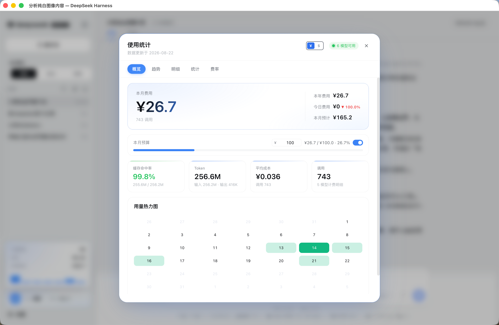
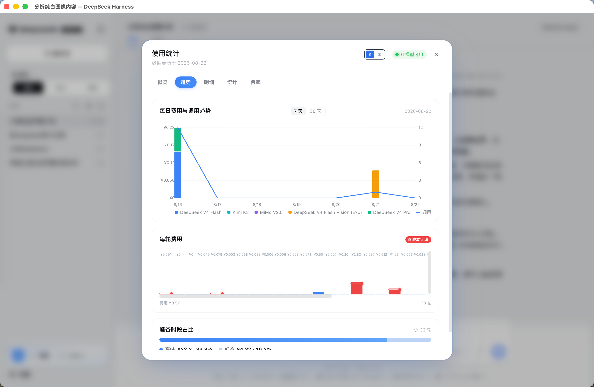
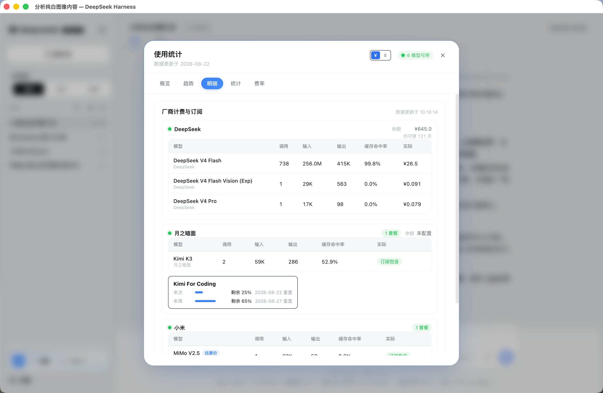
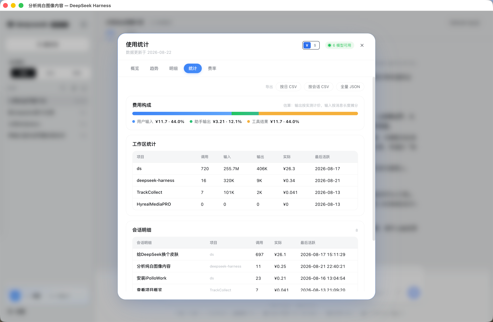
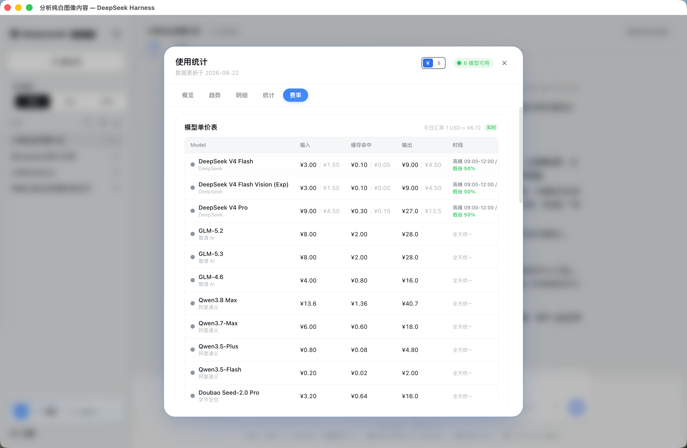

# dsh-ui-usage-billing

DeepSeek Harness 计费仪表盘插件。从持久化会话日志实时聚合模型用量，按多厂商最新官方价格估算费用，在侧边栏一键查看完整仪表盘。


[](https://github.com/kenz1117/dsh-ui-usage-billing/blob/main/LICENSE)[](https://github.com/kenz1117/dsh-ui-usage-billing)
[](https://github.com/kenz1117/dsh-ui-usage-billing)
[](https://www.npmjs.com/package/@kenz1117/dsh-ui-usage-billing)
[](https://awesome-dsh-plugin.com)

## 特性

- **侧边栏入口**：设置按钮上方的玻璃拟态渐变触发卡，显示**当月费用 + 今日费用**，hover 光晕上浮；折叠栏自动切换为渐变徽章图标。
- **低调科技风视觉（0.9.0 重构）**：面板全面去「AI 味」——移除渐变描边、毛玻璃、径向光晕与渐变文字大数字，改为令牌实底 + 1px 描边 + 明度分层图表的克制冷调；Tab 收敛为下划线 + 单色强调，图表与热力图按明度分层，配色全部走 `--dsw-*` 令牌、深浅主题自适应。
- **计费仪表盘（分区 Tab）**：弹窗按 **概览 / 趋势 / 明细 / 统计 / 费率** 五个分区组织——概览（Hero 本月大数字 + 本年 / 今日环比 / **本月预计** + 预算条 + KPI×4 + 用量热力图）、趋势（每日费用趋势图 7/30 天 + 每轮费用）、明细（厂商计费与订阅）、统计（工作区 + 会话明细）、费率（模型单价表）。渐变描边卡片 + 毛玻璃遮罩 + 进入动画，全部用设计令牌派生渐变色，深色/浅色主题自适应。
- **即时代费用条**：会话输入框下方常驻一行「本轮 ¥x · 会话 ¥y」，30 秒轮询刷新；同时显示**峰谷当前档位与切换倒计时**（峰时 / 平价 + 距下次切档时间），以及订阅套餐低额度预警 chips（剩余 ≤20% 时浮现，≤10% 变红），无需打开仪表盘。
- **峰/谷切换提醒**：距进入下一计费档（北京时间高峰 9-12 / 14-18）不足 2 分钟时系统通知一次（同一切换点只提醒一次，`lastTierSwitchAt` 持久化），文案区分「即将进峰时 ×2 可稍等」/「即将进平价 价格减半」。
- **价格目录抓取（models.dev）**：费率表不再只靠内置目录——启动时抓取 models.dev 公开目录（pi-ai 预制提供方的上游数据源，USD / 1M tokens），**所有有价模型都纳入**费率表，探测到的系统预制模型据此对标定价。定价失败自动降级内置目录。
- **探活模型对标**：费率表按宿主 `llm.models` 探活到的「系统设置里实际配置/预制的模型」补齐——有价的显示价格（内置目录 / models.dev），无价的标注「未收录」，不参与计价（不误估）。
- **自定义 Provider 余额**：除内置 DeepSeek / Kimi / 阶跃星辰外，可经 config `customBalances` 配置任意 HTTP 端点查询余额，`extract` 规则支持常量 / 点路径 / add-subtract / divide（适配 NewApi、LiteLLM 等 quota 端点），请求头 `{{ENV_NAME}}` 占位符经凭据 seam 解析，独立厂商组展示。
- **月度预算**：仪表盘内置预算条——开关控制显隐、金额可直接编辑（已用 / 总额 / 百分比进度，≥80% 转琥珀、超支转红并脉冲提示），偏好持久化在浏览器本地；宿主配置 `monthlyBudget` 可作为默认金额。
- **分档提醒**：跨过预算 50% / 80% / 100% 时各弹一次系统通知（每档每天最多一次，一次跨多档只发最高档）；通知不可用时进度条分档变色兜底。余额不足告警独立：任一厂商余额（折算人民币）低于阈值时每天提醒一次，阈值经宿主配置 `lowBalanceThreshold` 下发（默认 50 元）。
- **会话明细**：统计 Tab 内按费用倒序列出每个会话的花费（标题 / 项目 / 调用数 / 费用 / 最后活跃），直接回答「钱花在哪」。
- **真实用量**：服务端从会话日志实时聚合，无需手工维护统计文件；增量缓存保证只有写过的日志会被重新折叠，重度使用下轮询依然轻量。
- **模型健康探测**：模型行的圆点反映各厂商接入状态（正常绿 / 异常红 / 未接入灰）。
- **订阅计划豁免**：走 coding / token plan / opencode 订阅通道的模型照常统计 token、费用记 0（按**通道**判定，同一模型走按量通道时正常计费）。
- **余额查询**：厂商组头部显示该厂商余额（只显示一次，不再随每行重复）。DeepSeek、月之暗面（Kimi）、阶跃星辰（StepFun）用官方余额接口**实时查询**；API Key 复用 `llm-pi-ai` 设置的 `apiKeyEnv`（DeepSeek 另有 `balanceApiKeyEnv` 特例），未配置 / Key 无效 / 服务不可达均有状态提示，扩展点可接更多厂商。
- **可用天数估算**：余额列按最近 7 天日均消耗折算「约可撑 N 天」，剩余不足 3 天红色强调。
- **未收录模型标注**：真实模型 id 不在计费目录时，明细行显示真实 id 并标注「未收录」，费用按兜底档估算；厂商可从模型 id 自动推断（如 `mi-mimo-2.5` → 小米），健康圆点据此点亮。目录单价为估算价的模型（讯飞 / 商汤 / 小米）行内标注「估算价」，避免误当正式定价。
- **实时汇率与定价**：启动时自动拉取腾讯财经行情（USD→CNY）与 OpenRouter 官方模型价，失败自动降级内置默认值；此后每 6 小时自动刷新，单价表标注「今日汇率」与实时 / 内置徽标。
- **动态刷新**：侧边栏入口与仪表盘每 30 秒自动更新，无需重启或手动刷新。
- **更新时间**：模型计费明细表头显示最近一次统计的更新时间，精确到时分秒。
- **北京时间统一**：统计聚合与仪表盘日期一律按北京时间归天，跨零点不漂移。
- **精确时段计费**：每笔调用的费用按实际发生时刻（北京时间）精确判定高峰 / 低谷档，替代固定比例混合——凌晨调用不再被按高峰价估算。
- **订阅套餐额度**：自动识别你在 dsh `llm-pi-ai` 设置里配置的订阅类 provider（kimi-coding、zai-coding-cn、opencode、qwen/xiaomi/火山 token-plan、百度/GLM 等 coding/agent plan），只显示识别到的套餐；有额度 API 的（Kimi / Z.ai / OpenCode Go）实时显示剩余百分比与重置时间，无公开额度接口的标注「额度接口未接入」。进度条按**已用**比例填充（与预算条同语义）：已用 ≥80% 转琥珀、**用尽满格红 +「已用尽」**（窗口恒可见，不再因剩余 0% 消失）。面板默认展开，打开即见。
- **厂商计费与订阅（按厂商聚合）**：模型计费明细与订阅套餐合并为**单一容器**，按厂商作为一级分组——同厂商的非订阅按量模型（显示实际费用）与订阅套餐（显示额度卡片）落在同一组，避免散乱；余额与健康圆点只在厂商组头部显示一次（**余额是厂商的余额**，不再随每行重复）。订阅 provider 通过内置别名归并到对应模型厂商（如 `kimi-coding` → 月之暗面），无模型厂商的跨厂商通道（如 opencode）按自身名独立成组。
- **模型可用数按模型统计**：侧边栏入口右上角「N 模型可用」按**模型数量**统计（各厂商成功接入的模型之和），而非厂商数量，口径与文案一致。
- **用量热力图**：当月日历热力图（本月 1 号到今天每天一格，周日开头 7 列），按日费用分 5 档色阶，悬停显示日期与金额。概览 Tab 常驻。
- **每轮费用与成本突增**：按会话轮次折叠的每轮费用图（最近 40 轮），位于趋势 Tab；每根柱子顶部标注该轮费用数字，相对近 6 轮成本超 2 倍的轮次红色标注并归因（输出增长 / 上下文膨胀 / 缓存命中率下降）。
- **工作区统计**：按会话工作目录（cwd 末级）归并的花费 / 调用 / Token 汇总表。
- **双币种显示 & 多语种联动**：仪表盘右上角 ¥ / $ 切换——美元金额按当前汇率换算显示；面板文案同时随币种切换（USD → 英文、CNY → 中文，仅本插件生效，不影响宿主全局语言）。费率表的单价也按所选币种换算（切 USD 时人民币计价模型换算为 $，不再固定显示 ¥）。
- **触发卡 hover 速览**：悬停侧边栏触发卡即浮现速览卡（今日 / 本周 / 当月 + 近 7 天迷你柱），无需点开仪表盘。
- **峰谷时段占比**：趋势 Tab 内按每轮起始时刻（北京时间高峰 9-12 / 14-18）精确分摊高峰 / 空闲费用，堆叠条 + 金额百分比图例。
- **费用构成（估算）**：统计 Tab 内按角色归因的三段堆叠条（用户输入 / 助手输出 / 工具结果）——输出成本实测计价，输入成本按消息文本长度占比摊分（日志无角色级实测 token，标注估算口径）。
- **数据导出**：统计 Tab 顶部一键导出按日 CSV、按会话 CSV 与全量 JSON（文件名带日期范围），便于对账。
- **模型自查用量（`usage_stats` 动态工具）**：模型可在对话中直接查询用量费用（`today` / `month` / `session` / `all` 四档），例如"今天花了多少钱"；tools 服务缺席时自动跳过注册。
- **统计快照落盘**：聚合结果原子写（temp+rename，权限 600）到 `~/.dsh/.dsh-usage-stats.json`，重启首屏与聚合异常都有最近数据可看；启动时检测到另一实例的新鲜快照会告警（双实例会导致提醒重复）。
- **离线自包含**：无图表库、无外部 CDN，全部使用设计令牌，适配深色/浅色主题。

## 截图











## 快速开始

在宿主 `cordis.patch.yml` 中加入：

```yaml
- insert:
    - id: ui-usage-billing
      name: '@kenz1117/dsh-ui-usage-billing'
```

或通过包管理器安装：

```sh
npm install @kenz1117/dsh-ui-usage-billing
```

启动宿主后，侧边栏设置上方即出现计费入口。无需额外配置；`sessionPersistence` 可用时自动聚合真实用量。

## 工作原理

插件由服务端与浏览器端两部分组成：

```
浏览器端                                  服务端（Node）
  │                                        │
  ├─ GET /api/billing/usage-stats ────────▶ ├─ sessionPersistence 遍历持久化会话日志
  │                                        ├─ 按 request/header 归属模型
  │                                        ├─ token 按缓存命中 / 未命中分桶
  │                                        └─ 按实时单价表估算费用（人民币）
  ├─ GET /api/billing/pricing ────────────▶ ├─ 腾讯财经 / OpenRouter 实时汇率与模型价
  ├─ GET /api/billing/balance ────────────▶ ├─ DeepSeek 官方余额 API（凭据 seam 取 key）
  ├─ llm.models 健康探测 ─────────────────▶ └─ 返回聚合统计 JSON
  └─ 渲染仪表盘
```

- **服务端**（`src/index.ts`）：注入 `webServer`、`sessionPersistence` 与 `credentials`，注册 `GET /api/billing/usage-stats`、`/api/billing/pricing`、`/api/billing/balance`。聚合器按会话缓存折叠结果：一次 LLM 调用归属到其前置 `request/header` 记录的模型，token 拆分到缓存命中 / 未命中桶，日期按本机时区归天；日志文件 mtime+size 不变则直接复用缓存，只有写过的会话重新折叠，整份文档另有 5 秒 TTL 合并密集轮询。聚合逻辑见 `src/aggregate.ts`。
- **浏览器端**（`src/client/`）：请求上述接口渲染仪表盘，通过 `llm.models` 探测各厂商连接状态。真实数据到达前显示全零空快照，不展示伪造样本。

## 主题协作

本插件**不依赖任何主题包**，可独立安装运行。仪表盘弹窗声明 `billing.dashboard.decor` 装饰孔位（head / hero / trend / models / footer 锚点），并将实时费用摘要注册为 `ctx.billingMetrics` 服务：主题插件（如 acid-zine）主动注入 MacDots / 胶带 / 撕角便签等装饰视觉、订阅费用数据渲染自己的贴纸层。插件与主题各自独立装卸——主题不存在时走默认视觉，billing 不存在时主题照常运行。

## 计费引擎

单价表（`src/client/pricing.ts`）采用**原生币种**存储：国内厂商直接录入人民币价格，国外厂商录入美元价格。费用统一以人民币计算与展示——美元模型按**实时汇率**折算，国内模型全程不经过汇率换算。启动时服务端拉取实时汇率与模型价（`src/pricing-fetch.ts`）：USD→CNY 优先腾讯财经行情（免 key、国内可达），失败依次降级 open.er-api 与内置默认值；之后每 6 小时后台刷新，单价表弹窗标注「今日汇率」与实时 / 内置徽标。金额与费率表的**展示币种跟随用户所选**：切 ¥ / $ 时把每条每百万 token 单价经 `convertUnitPrice` 按实时汇率换算到目标币种再显示（汇率缺失时回退原生币种）。

```
cost（CNY）= (missInput × p_input + cacheHit × p_cacheHit + output × p_output) / 10⁶
           —— 价格为原生币种；美元模型按实时 USD → CNY 汇率折算
```

统计中的 `input` 为总输入（cacheHit + cacheMiss），估算按命中 / 未命中分拆计价，避免重复计费。支持双档计费的模型按 `DEFAULT_PEAK_SHARE`（默认 0.5）混合高峰与低谷档。

### 支持模型（2026-08-21 主流阵容，OpenAI 兼容系列）

| 厂商       | 模型                                                                                      |
| -------- | --------------------------------------------------------------------------------------- |
| DeepSeek | V4 Flash、V4 Flash Vision (Exp)、V4 Pro（按时段峰谷计费：高峰 09:00-12:00 / 14:00-18:00 北京 = 低谷 2 倍） |
| 智谱 AI    | GLM-5.3、GLM-5.2、GLM-4.6                                                                 |
| 阿里通义     | Qwen3.8 Max、Qwen3.7-Max、Qwen3.5-Plus、Qwen3.5-Flash                                      |
| 字节豆包     | Doubao Seed-2.0 Pro、Seed-2.0 Mini、Seed-1.6                                              |
| 月之暗面     | Kimi K3、K2.7 Code、K2.7 Code HighSpeed、K2.6                                              |
| 小米       | MiMo V2.5（走 token plan 订阅通道时豁免计费）¹                                                      |
| MiniMax  | MiniMax-M3                                                                              |
| 百度       | ERNIE-5.1                                                                               |
| 腾讯       | 混元 T1、混元 Hy3                                                                            |
| 零一万物     | Yi-Lightning                                                                            |
| 阶跃星辰     | Step 3.7 Flash                                                                          |
| 科大讯飞     | Spark 4.0 Ultra（套餐制）¹                                                                   |
| 商汤       | SenseNova 6.5（公测中）¹                                                                     |
| 百川智能     | Baichuan M3-Plus                                                                        |
| OpenAI   | GPT-5.6 Sol / Terra / Luna                                                              |
| Google   | Gemini 3.1 Pro、3.6 Flash（Standard / Flex 双档，Flex = -50%）                                |
| xAI      | Grok 4.6、Grok 4.3                                                                       |
| Meta     | Llama 4 Maverick、Scout                                                                  |
| 其他       | 未收录模型的统一回退定价                                                                            |

> ¹ 讯飞、商汤、小米未公布按量单价，表内为估算价；这些模型走订阅通道（coding / token plan / opencode）时费用记 0，正式定价公布后自动校准。订阅通道与 pi-ai 内置提供方对齐（kimi-coding、zai-coding-cn、opencode、opencode-go、qwen/xiaomi 的 token-plan 各区域变体），可按 `subscriptionProviders` 配置覆盖。

新增模型：在 `MODEL_CATALOG` 追加条目，并在 `src/client/pricing.ts` 的 `MODEL_KEY_ALIASES` 中映射真实模型 id（聚合层与客户端渲染共用同一张表）。

## HTTP API

### `GET /api/billing/pricing`

实时定价文档（汇率 + 模型价，6 小时后台刷新），浏览器端单价表数据源：

```json
{
  "source": "live",
  "rate": 7.11,
  "rateTime": "2026-08-16T12:00:00+08:00",
  "models": {
    "flash": { "input": 3, "output": 9, "cacheHit": 0.1 }
  }
}
```

`source` 为 `live`（腾讯财经 / OpenRouter 拉到）或 `builtin`（全部降级内置默认值）；`rate` 为 USD→CNY 实时汇率。

### `GET /api/billing/balance`

各接入厂商账户余额。API Key 复用 `llm-pi-ai` 设置的 `providers.<id>.apiKeyEnv`（DeepSeek 未在 llm-pi-ai 配置时回退到 `balanceApiKeyEnv`）：

```json
{
  "balances": [
    {
      "provider": "deepseek",
      "displayName": "DeepSeek",
      "currency": "CNY",
      "totalBalance": 12.34
    },
    {
      "provider": "月之暗面",
      "displayName": "月之暗面",
      "currency": "CNY",
      "totalBalance": 49.59,
      "grantedBalance": 46.59,
      "toppedUpBalance": 3.0
    },
    {
      "provider": "阶跃星辰",
      "displayName": "阶跃星辰",
      "currency": "CNY",
      "totalBalance": 150.0,
      "toppedUpBalance": 200.0,
      "grantedBalance": 50.0
    }
  ]
}
```

查询失败时对应条目带 `error`（`unconfigured` / `unauthorized` / `unreachable`），表格按此渲染状态提示。

### `GET /api/billing/usage-stats`

聚合统计文档，浏览器端数据源：

```json
{
  "total": {
    "calls": 733,
    "input": 255931033,
    "output": 414286,
    "cacheHit": 255525760,
    "cacheMiss": 405273,
    "cost": 22.87
  },
  "byModel": {
    "flash": { "calls": 733, "input": 255931033, "output": 414286, "cacheHit": 255525760, "cacheMiss": 405273, "cost": 22.87 }
  },
  "byDay": {
    "2026-08-15": { "calls": 74, "input": 32593373, "output": 35375, "cacheHit": 32558208, "cacheMiss": 35165, "cost": 0.52 }
  },
  "byDayModels": {
    "2026-08-15": {
      "flash": { "calls": 74, "input": 32593373, "output": 35375, "cacheHit": 32558208, "cacheMiss": 35165, "cost": 0.52 }
    }
  }
}
```

字段含义：`input` 为总输入 token；`cacheHit` / `cacheMiss` 为缓存命中 / 未命中分桶；`cost` 为人民币估算费用。`byDayModels` 是 **模型 × 日期** 二维统计（`[date][modelKey]`），趋势图按模型堆叠的输入；当年 / 当月 / 当日三维费用由浏览器端按 `byDay` 日期前缀归并。`bySession` 为会话明细（按费用倒序，封顶 100 行）：`title` 取自日志中最新的 `session/title` 事件，`cwd` 为会话创建时的工作目录。配置 `monthlyBudget` 时响应额外携带 `budget` 字段（两条服务路径一致注入）。`sessionPersistence` 不可用时回退到配置文件（见下）。

## 配置

| 字段                      | 默认                                   | 说明                                                                                                           |
| ----------------------- | ------------------------------------ | ------------------------------------------------------------------------------------------------------------ |
| `statsPath`             | 未设置                                  | 回退统计文件 `.dsh-usage-stats.json` 的绝对路径（`sessionPersistence` 不可用时生效）                                            |
| `balanceApiKeyEnv`      | `DEEPSEEK_API_KEY`                   | DeepSeek 余额查询的凭据引用；仅在 llm-pi-ai 未配置 deepseek 的 `apiKeyEnv` 时兜底使用                                             |
| `subscriptionProviders` | `kimi-coding`、`xiaomi-token-plan-cn` | 订阅制（coding / token 套餐）provider id 列表，照常统计 token、费用记 0                                                        |
| `monthlyBudget`         | 未设置                                  | 月度预算默认金额（人民币元）；随 usage-stats 下发，作为仪表盘预算条的初始金额（用户在界面上的设置优先并本地持久化）                                             |
| `lowBalanceThreshold`   | `50`                                 | 余额不足告警阈值（人民币元）；随 usage-stats 下发，任一厂商余额折算人民币低于此值时每天提醒一次                                                       |
| `subscriptionPlans`     | 自动识别                                 | 订阅额度适配器白名单（`{ provider, baseUrl?, region? }`）；缺省时自动从 `llm-pi-ai` 设置识别所有订阅类 provider（有额度 API 的查额度，无 API 的仅标识） |

## 开发

环境要求：Node.js ^22.19 || >=24，pnpm。

```sh
pnpm install
pnpm --filter @kenz1117/dsh-ui-usage-billing bundle   # 构建 lib/index.js 与 lib/client.js
npx vitest run packages/client/ui-usage-billing/tests  # 单元测试
```

## 发布

本包为独立 npm 包，发布后即可被其他 DeepSeek Harness 宿主安装。

```sh
npm publish --access public
```

宿主通过 `package.json` 的 `dsh.client` 声明（`platform: web`）与 `exports["./client"]` bundle 自动发现浏览器端，无需注册中心登记。

## Model Experience

无。本插件是纯 UI surface：不注册工具、不注入系统提示、不向会话日志写入任何模型可见事件。仪表盘读取的用量统计由服务端从既有会话日志聚合，日志内容由其他包各自负责。

#### KV Cache effect

无直接影响。插件不改变任何会话的提示前缀或历史，不触及 KV 缓存。

## Known Limitations and Deferred Work

- **余额查询已接入 DeepSeek / 月之暗面（Kimi）/ 阶跃星辰（StepFun）**：这三家用标准 Bearer API key 即可查询。其余厂商因无公开余额接口或需非 Bearer 鉴权（小米 MiMo 走控制台 Cookie、商汤走 AccessKey 签名、MiniMax/字节豆包走额度制或 AK/SK），暂显示「未配置」；扩展点在 `src/balance.ts`（按厂商余额 API 增加查询器）。
- **超支通知依赖浏览器 Notification**：权限被拒绝或平台不支持时只有界面红色脉冲兜底，没有宿主级通知通道；通知上限为每天一次。
- **会话明细不可跳转**：点击会话行不会打开对应会话（跨插件导航需要宿主会话选择通道）；会话数封顶 100 行、面板只显示前 20 行。
- **费用为目录价估算**：讯飞 / 商汤 / 小米等未公布按量单价的模型使用估算价（特性表脚注 ¹），正式定价以厂商账单为准。
- **30 天趋势受日志保留范围约束**：超出持久化日志保留期的日期在窗口内补零显示，不回溯历史。

## 许可证

[MIT](LICENSE) © 2026 KenZ (kenz1117)
